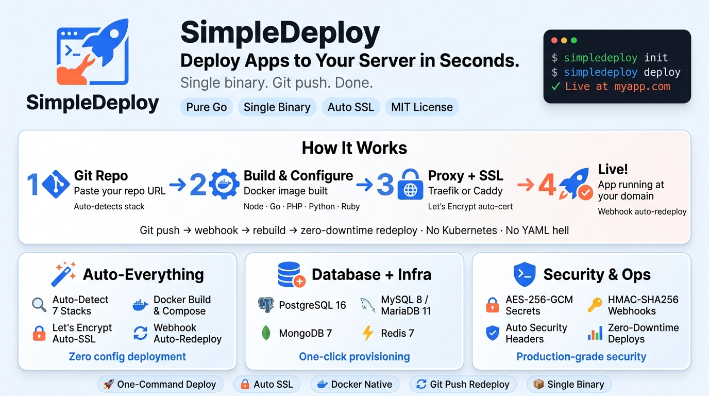

# SimpleDeploy

**Single-Binary PaaS CLI — Deploy apps to your server in seconds.**

<p align="center">
  
</p>

> **Note:** This project is currently in development and not yet ready for production use.

SimpleDeploy is a zero-external-dependency PaaS tool written in Go. Provide a Git repo URL, and it handles the rest: Docker setup, image build, database provisioning, reverse proxy (Traefik or Caddy), SSL certificates, and auto-deploy via webhooks.

## Philosophy

`#NOFORKANYMORE` — Do what Coolify/Dokploy does with clean, minimal Go code. Generate docker-compose.yml, that's it.

## Features

- **Single binary** — No runtime dependencies. Static Go binary.
- **Interactive wizards** — `init` and `deploy` walk you through everything.
- **Auto-detection** — Detects Node.js, Go, PHP, Python, Ruby, static sites, or uses your Dockerfile.
- **Database provisioning** — MySQL 8, PostgreSQL 16, MariaDB 11, MongoDB 7, Redis 7.
- **Reverse proxy** — Traefik (auto-discovery) or Caddy (auto-SSL).
- **Let's Encrypt** — Automatic SSL certificate provisioning.
- **Webhook auto-deploy** — Push to GitHub → instant redeploy with HMAC-SHA256 verification.
- **Encrypted secrets** — AES-256-GCM encryption for tokens and passwords.
- **Security headers** — Automatic security headers on every app.
- **Service mode** — Run SimpleDeploy itself as a Docker container.
- **Zero-downtime** — Rolling deploys with health checks.

## Quick Start

```bash
# Install
curl -fsSL https://simpledeploy.dev/install | sh

# First-time setup
simpledeploy init

# Deploy your first app
simpledeploy deploy

# Push to GitHub → auto-deploy!
```

## CLI Commands

```bash
simpledeploy init                # First-time setup (interactive wizard)
simpledeploy deploy              # Deploy a new application
simpledeploy list                # List deployed applications
simpledeploy redeploy <app>      # Redeploy an application
simpledeploy remove <app>        # Remove an application
simpledeploy logs <app>          # Show application logs
simpledeploy status              # Show SimpleDeploy status
simpledeploy service install     # Install as Docker service
simpledeploy service start       # Start the service
simpledeploy service stop        # Stop the service
simpledeploy webhook start       # Start webhook server
simpledeploy version             # Show version
```

## How It Works

1. **`simpledeploy init`** — Checks Docker, sets up Traefik/Caddy, configures domain, SSL, and webhook secret.
2. **`simpledeploy deploy`** — Clones your repo, detects the framework, builds a Docker image, generates docker-compose.yml, starts containers behind the reverse proxy.
3. **Webhook** — Receives GitHub push events, verifies HMAC-SHA256, pulls latest code, rebuilds, and redeploys.

## Architecture

```
simpledeploy (single binary)
├── internal/
│   ├── cli/         → CLI command handlers
│   ├── wizard/      → Interactive prompts & ANSI colors
│   ├── git/         → Git clone/pull
│   ├── docker/      → Docker install, build, compose
│   ├── compose/     → YAML generator
│   ├── proxy/       → Traefik / Caddy setup
│   ├── webhook/     → HTTP webhook server
│   ├── db/          → Database provisioning
│   ├── state/       → JSON state management + AES crypto
│   ├── buildpack/   → Auto-detect & generate Dockerfiles
│   └── runner/      → Self-containerization
└── templates/       → Embedded templates
```

## Runtime File Structure

```
/opt/simpledeploy/
├── config.json              → Global config
├── state.json               → All apps' state
├── proxy/
│   └── docker-compose.yml   → Traefik/Caddy compose
├── apps/
│   └── <app-name>/
│       ├── source/           → Git clone
│       ├── docker-compose.yml → Generated compose
│       ├── .env              → Environment variables
│       └── deploy.log        → Deploy history
└── service/
    └── docker-compose.yml    → SimpleDeploy's own compose
```

## Supported Stacks

| Type      | Detection          | Default Port |
|-----------|-------------------|--------------|
| Node.js   | `package.json`    | 3000         |
| Go        | `go.mod`          | 8080         |
| PHP       | `composer.json` / `.php` | 80   |
| Python    | `requirements.txt` / `pyproject.toml` | 8000 |
| Ruby      | `Gemfile`         | 3000         |
| Static    | `.html` files     | 80           |
| Docker    | `Dockerfile`      | 3000         |

## Build from Source

```bash
git clone https://github.com/ersinkoc/SimpleDeploy.git
cd SimpleDeploy
CGO_ENABLED=0 go build -o simpledeploy .
```

## Build as Docker Image

```bash
docker build -t simpledeploy:latest .
```

## Requirements

- Linux server (Ubuntu/Debian/CentOS/Fedora recommended)
- Go 1.22+ (for building)
- Docker Engine (auto-installed by `simpledeploy init`)

## Security

- Git tokens and DB passwords encrypted with AES-256-GCM
- Machine-id-based encryption key
- HMAC-SHA256 webhook verification
- Automatic security headers on every application
- Docker socket access restricted to SimpleDeploy container

## Author

**Ersin KOC**
- GitHub: [ersinkoc](https://github.com/ersinkoc)
- X: [@ersinkoc](https://x.com/ersinkoc)

## License

MIT License — see [LICENSE](LICENSE) for details.
