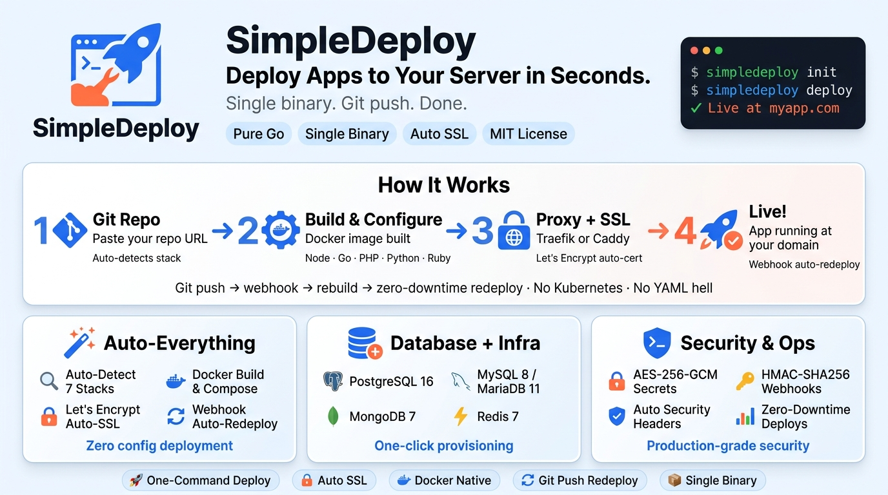

# SimpleDeploy

**Single-Binary PaaS CLI — deploy an app from a Git repo to your own server.**

<p align="center">
  
</p>

SimpleDeploy is a zero-dependency PaaS tool written in Go. Give it a Git repo URL and it handles the rest: Docker setup, image build, database provisioning, reverse proxy (Traefik or Caddy), SSL certificates, and push-to-deploy via webhooks.

> **Status: beta.** The full path — deploy → proxy → SSL → webhook → rollback — works end to end as of 0.1.0. It has not yet been run at scale. Back up `~/.simpledeploy/state.json`; it holds your encrypted tokens and database passwords.

## Philosophy

`#NOFORKANYMORE` — do what Coolify/Dokploy do, with clean minimal Go. Generate a `docker-compose.yml`, that's it.

## Features

- **Single binary** — no runtime dependencies beyond Docker and git.
- **Interactive wizards** — `init` and `deploy` walk you through everything.
- **Auto-detection** — Node.js, Go, PHP, Python, Ruby, static sites, or your own Dockerfile.
- **Database provisioning** — MySQL 8, PostgreSQL 16, MariaDB 11, MongoDB 7, Redis 7, with health checks and startup ordering.
- **Reverse proxy** — Traefik (container auto-discovery) or Caddy.
- **Let's Encrypt** — automatic SSL, HTTP→HTTPS redirect.
- **Push-to-deploy** — GitHub/GitLab/Gitea push events trigger a rebuild, with signature verification and **automatic rollback** if the new image fails to start.
- **Encrypted secrets** — AES-256-GCM for git tokens and database passwords.
- **Security headers** — applied to every app by default.
- **No public port surface** — app containers are reachable only through the proxy.

## Quick Start

```bash
# 1. Install (auto-detects OS/arch)
curl -fsSL https://raw.githubusercontent.com/ersinkoc/SimpleDeploy/main/install.sh | sh
sudo mv simpledeploy /usr/local/bin/

# 2. First-time setup — picks a proxy, domain, SSL email, webhook secret
simpledeploy init

# 3. Deploy
simpledeploy deploy

# 4. Turn on push-to-deploy
simpledeploy webhook start
```

Or download a binary from [Releases](https://github.com/ersinkoc/SimpleDeploy/releases) (Linux, macOS, Windows × amd64, arm64).

### DNS

`init` asks about wildcard DNS. You need **both** records:

| Record | Points to | Used for |
|--------|-----------|----------|
| `*.apps.example.com` | server IP | your deployed apps |
| `apps.example.com` | server IP | the webhook endpoint (`/_qd/*`) |

The second one is easy to forget and is why a webhook can return a TLS error while the apps themselves work fine.

## CLI Commands

```bash
simpledeploy init                # First-time setup (interactive wizard)
simpledeploy status              # Proxy + application status

simpledeploy deploy              # Deploy a new application (interactive)
simpledeploy list                # List deployed applications
simpledeploy redeploy <app>      # Rebuild and restart an application
simpledeploy restart <app>       # Restart an application's container
simpledeploy stop <app>          # Stop an application
simpledeploy remove <app>        # Remove an application and its files
simpledeploy logs <app> [-f]     # Show logs (-f to follow)
simpledeploy exec <app> <cmd>    # Run a command inside the app container

simpledeploy webhook start       # Run the push-to-deploy listener
simpledeploy service install     # Generate compose to run the listener as a container
simpledeploy service start|stop  # Start/stop that container

simpledeploy version             # Show version
```

## How It Works

1. **`init`** — checks Docker **and the Compose plugin**, starts Traefik or Caddy on the `simpledeploy` network, requests Let's Encrypt certs, and publishes the webhook endpoint at `https://<base-domain>/_qd/`.
2. **`deploy`** — clones the repo, detects the framework, generates a Dockerfile + `.dockerignore` if the repo has none, builds an image, writes a `docker-compose.yml`, starts the container behind the proxy, and polls until it reports `running`.
3. **Webhook** — verifies the push signature, pulls the latest commit, rebuilds, restarts, and **rolls back to the previous image** if the new container exits.

A failed or cancelled deploy removes the app directory it created, so nothing is left holding generated database credentials.

### Push-to-deploy

`init` publishes the route; the **listener has to be running** for it to answer.

```bash
simpledeploy webhook start          # foreground — run it under systemd for real use
# or
simpledeploy service install
simpledeploy service start          # runs the listener as a container
```

Then add a webhook to your repository:

| Field | Value |
|-------|-------|
| Payload URL | `https://<base-domain>/_qd/webhook/<app-name>` |
| Content type | `application/json` |
| Secret | the webhook secret from `init` |
| Events | push only |

`simpledeploy deploy` prints all of this, filled in, after a successful deploy.

Only pushes to the app's configured branch trigger a deploy. Requests without a valid signature are rejected, and **the server refuses to deploy at all when no secret is configured** — it will not fall back to trusting anonymous requests.

Supported providers: GitHub and Gitea (HMAC-SHA256), GitLab (constant-time token compare).

## Architecture

```
simpledeploy (single binary)
├── main.go
└── internal/
    ├── cli/         → command handlers
    ├── wizard/      → interactive prompts & ANSI colors
    ├── git/         → clone (shallow) / fetch + hard reset
    ├── docker/      → install check, build, compose, image pruning
    ├── compose/     → docker-compose.yml generator (deterministic output)
    ├── proxy/       → Traefik / Caddy setup + webhook routing
    ├── webhook/     → HTTP listener (GitHub/GitLab/Gitea)
    ├── db/          → database provisioning
    ├── state/       → JSON state + AES-256-GCM + input validation
    ├── buildpack/   → framework detection & Dockerfile generation
    ├── config/      → path resolution
    └── runner/      → self-containerization
```

Dockerfile templates are Go constants in `internal/buildpack/detect.go`. There is **no external template directory** to keep in sync.

## Runtime File Structure

```
~/.simpledeploy/
└── state.json                   → apps + global config (AES-encrypted secrets)

/opt/simpledeploy/
├── proxy/
│   ├── docker-compose.yml       → Traefik/Caddy
│   ├── Caddyfile                → (Caddy only) per-app routes + /_qd/*
│   └── dynamic/webhook.yml      → (Traefik only) /_qd/* route
├── apps/
│   └── <app-name>/
│       ├── source/              → git clone
│       ├── docker-compose.yml   → generated compose (mode 0600)
│       ├── .env                 → environment variables (mode 0600)
│       └── deploy.log           → deploy history
└── service/
    └── docker-compose.yml       → SimpleDeploy's own compose
```

## Environment Variables

| Variable | Default | Purpose |
|----------|---------|---------|
| `SIMPLEDEPLOY_DIR` | `/opt/simpledeploy` | Root for proxy, app, and service data |
| `SIMPLEDEPLOY_STATE_DIR` | `~/.simpledeploy` | Where `state.json` lives |

They are separate because the containerised service runs with `$HOME=/root`; the generated compose bind-mounts both host paths and sets both variables.

## Supported Stacks

Detection runs top to bottom; a committed `Dockerfile` always wins.

| Type      | Detection                             | Default Port |
|-----------|---------------------------------------|--------------|
| Docker    | `Dockerfile`                          | 3000         |
| Node.js   | `package.json`                        | 3000         |
| Go        | `go.mod`                              | 8080         |
| Python    | `requirements.txt` / `pyproject.toml` | 8000         |
| PHP       | `composer.json` / `*.php`             | 80           |
| Ruby      | `Gemfile`                             | 3000         |
| Static    | `*.html`                              | 80           |

Generated Dockerfiles are conservative starting points: they install dependencies, run a `build` script only if one exists, and fall back to conventional entrypoints. **If your app needs anything specific, commit your own Dockerfile** — it is always preferred over the template.

## Databases

| Type       | Image            | Injected env |
|------------|------------------|--------------|
| MySQL      | `mysql:8`        | `DATABASE_URL`, `MYSQL_URL` |
| PostgreSQL | `postgres:16`    | `DATABASE_URL`, `POSTGRESQL_URL` |
| MariaDB    | `mariadb:11`     | `DATABASE_URL`, `MARIADB_URL` |
| MongoDB    | `mongo:7`        | `MONGODB_URI` |
| Redis      | `redis:7-alpine` | `REDIS_URL` |

`DATABASE_URL` points at the first SQL database you select. Passwords are generated per app, stored encrypted in state, and written into the app's compose file (mode 0600).

### Bringing your own `.env`

`deploy` can import an existing `.env`. Its contents are preserved verbatim and the variables SimpleDeploy generates are appended **after** it, so a stale `DATABASE_URL` in your file cannot shadow the connection string for the database just provisioned.

## Troubleshooting

**Webhook returns 404** — the proxy route is missing. Re-run `simpledeploy init` (it rewrites the proxy config) and check that `apps.example.com` has an A record, not just the wildcard.

**Webhook returns 502** — the route exists but nothing is listening. Start the listener: `simpledeploy webhook start`.

**Webhook returns 401** — signature mismatch. Confirm the secret in your repository settings matches the one in `~/.simpledeploy/state.json`, and that the payload content type is `application/json`.

**`simpledeploy list` shows `error`** — the container is not running. `simpledeploy logs <app>` shows why. After a failed redeploy the previous image has already been restored automatically.

**Build fails on a generated Dockerfile** — the template did not fit your project. Commit your own `Dockerfile`; it takes precedence and the template is not used again.

**`docker: 'compose' is not a docker command`** — install the Compose plugin (`apt-get install docker-compose-plugin`). `init` checks for this up front as of 0.1.0.

## Build from Source

```bash
git clone https://github.com/ersinkoc/SimpleDeploy.git
cd SimpleDeploy
make build          # or: CGO_ENABLED=0 go build -o simpledeploy .
make test           # unit tests
make lint           # go vet ./...
make release        # cross-compile all platforms into dist/
```

### Integration tests

Tests that drive a real Docker daemon — building images, starting containers,
and (for the proxy) binding ports 80/443 — are opt-in, because they cannot run
on an unprivileged CI runner. `make test` skips them. To run everything:

```bash
make test-integration   # SIMPLEDEPLOY_INTEGRATION=1 go test -p=1 -count=1 ./...
```

They also run weekly and on demand via the **Integration Tests** workflow.

Version is stamped at link time from the Makefile, so `simpledeploy version` always matches the build.

## Build as Docker Image

```bash
docker build -t simpledeploy:latest .
```

## Requirements

- Linux server (Ubuntu/Debian/CentOS/Fedora)
- Docker Engine **and** the Docker Compose plugin — `init` verifies both; the engine can be auto-installed
- Go 1.23+ to build from source

## Security

- Git tokens and DB passwords encrypted with AES-256-GCM; any crypto failure aborts the operation rather than falling back to plaintext.
- Encryption key derived from the machine ID, mounted read-only into the service container so both modes agree.
- Webhook verification: HMAC-SHA256 (GitHub, Gitea), constant-time token compare (GitLab). **Deploys are refused entirely when no secret is configured.**
- Per-IP fixed-window rate limiting on the webhook endpoint, IPv6-safe.
- Git credentials passed via `GIT_ASKPASS` + environment, never on the command line; redacted from all error output.
- App containers use `expose`, not `ports` — not reachable except through the proxy.
- Input validation at every boundary that reaches a config file: domains, emails, header names and values, env keys, image tags, volume names, container paths.
- `.env` and generated compose files are mode 0600; generated `.dockerignore` keeps `.git` out of built images.
- Atomic proxy config writes — a partial write cannot leave a broken Caddyfile in place.

## Changelog

See [CHANGELOG.md](CHANGELOG.md). Release 0.1.0 is an audit release; read it before upgrading from 0.0.x, as several defaults changed.

## Upgrading from 0.0.x

```bash
simpledeploy init      # rewrites the proxy config: file provider, extra_hosts, webhook route
```

Existing apps keep running. Redeploy each app (`simpledeploy redeploy <app>`) to regenerate its compose file with `expose` instead of published host ports.

## Author

**Ersin KOC** — [GitHub](https://github.com/ersinkoc) · [X](https://x.com/ersinkoc)

## License

MIT — see [LICENSE](LICENSE).
